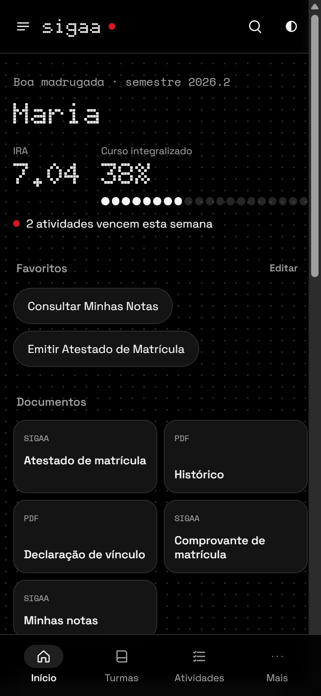
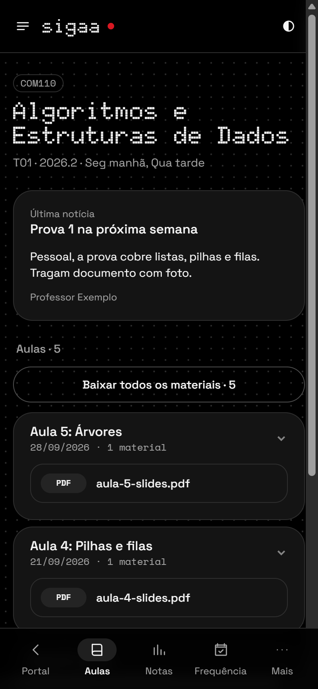
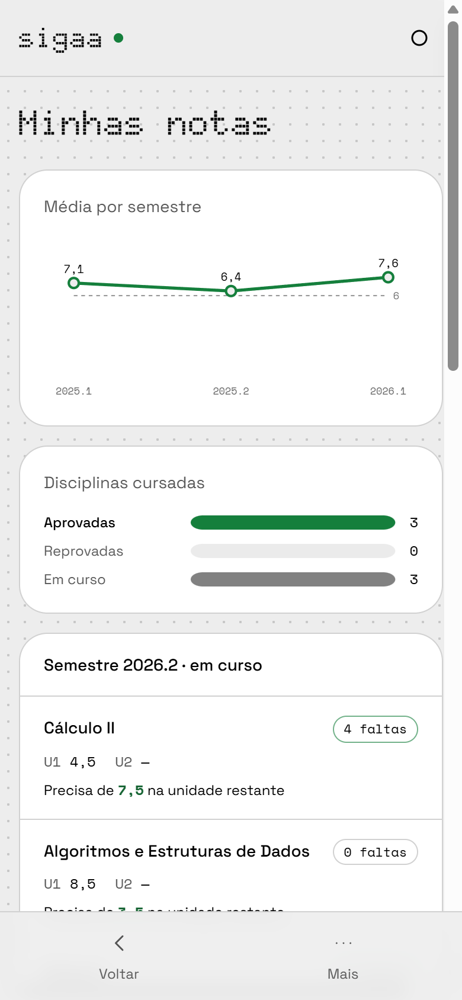
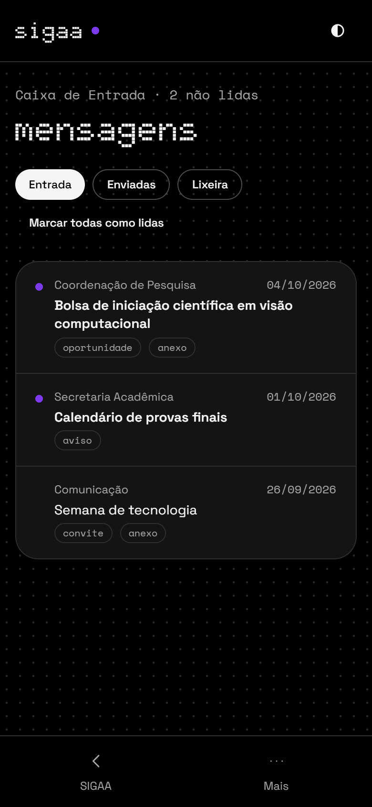
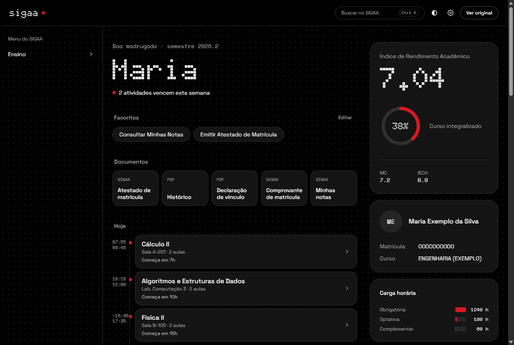

# SIGAA Repaginado

> **Projeto pessoal de um aluno. Não é oficial** e não tem vínculo com a UNIFEI, com a DTI nem com a UFRN, que desenvolve o SIGAA.

O SIGAA funciona, mas usar no dia a dia é cansativo. As telas foram feitas para monitores de 2008, ficam minúsculas no celular, cada clique pisca a página inteira e as informações importantes ficam espalhadas por menus.

Este projeto é uma prova de que dá para ter uma interface decente **em cima do mesmo sistema**, sem mudar nada no servidor. Ele lê as páginas que o SIGAA já entrega e as redesenha. Os dados continuam vindo do SIGAA, e nada sai do seu aparelho.

<p align="center">
  
  
  
  
</p>

<p align="center">
  
</p>

<sub>As capturas usam dados fictícios.</sub>

## O que muda

**Dia a dia**
- **Início** mostra as aulas de hoje numa linha do tempo, com horário real e "começa em 25 min".
- **Grade semanal** com as aulas em calendário, e exportação para Google Agenda (`.ics`).
- **Atividades e prazos**, com a opção de marcar como feita.
- **Novidades das turmas** desde a última visita.
- **Busca** em todo o menu do SIGAA (`Ctrl K`), com favoritos.
- **Documentos** a um toque: atestado, histórico, declaração de vínculo e comprovante.

**Notas e frequência**
- **Notas do semestre** com previsão pela regra da UNIFEI: o resultado é a média das unidades, e a recuperação substitui a menor nota. Mostra quanto falta para a média 6.
- **Gráfico de média por semestre** e simulador de média.
- **Faltas por disciplina**, com medidor na página de frequência.
- **Aviso quando sai nota nova**: o app busca as notas sozinho e notifica.

**Turmas e mensagens**
- **Aulas** em cartões, com o botão "baixar todos os materiais".
- **Caixa postal** legível, com etiquetas e indicação de não lidas.
- **Conflitos de horário** destacados em tabelas de matrícula e comprovante.

**Interface**
- **Temas** claro e escuro, seis cores de destaque e três tamanhos de texto. O contraste segue o WCAG AA.
- **Visual inspirado no Nothing OS**: fonte em matriz de pontos, animações curtas e nada de página piscando.
- **Telas pensadas para o celular**, com navegação inferior, menus em gaveta e tabelas viradas cartões.
- **Tela própria** quando o SIGAA cai ou a internet falha, mostrando a última versão salva.

**Só no app Android**
- **Login com digital**: a senha fica no Keystore do aparelho, protegida por biometria.
- **Sessão renovada** enquanto o app está em uso. O SIGAA desloga com 25 minutos parado.
- **Lembretes** 10 minutos antes da aula e na véspera de prazos.
- **Widget** "próxima aula" na tela inicial.
- **Bloqueio do app** com digital, opcional.
- **Atualização automática** pelas releases deste repositório.

## Como usar

### App Android
Baixe o `.apk` da [última release](../../releases/latest) e instale. Talvez seja preciso permitir a instalação de fontes desconhecidas. As próximas versões chegam pelo próprio app.

### Extensão (Chrome, Edge, Vivaldi, Brave)
1. Baixe o `sigaa-repaginado-*-chrome.zip` da [última release](../../releases/latest) e descompacte.
2. Abra `chrome://extensions`, ligue o **Modo do desenvolvedor** e clique em **Carregar sem compactação**.
3. Selecione a pasta descompactada e abra o SIGAA.

### Firefox (computador e Android)
Use o `sigaa-repaginado-*-firefox.zip`. No computador, carregue-o pelo `about:debugging`, em "Carregar extensão temporária".

Se algo não aparecer, o botão **Ver original** volta para o SIGAA de sempre.

## Como funciona

```
SIGAA (HTML do servidor) ──► adaptadores ──► dados tipados ──► interface React
        ▲                    src/adapters     src/domain        src/ui
        └──── cliques e formulários continuam sendo os do próprio SIGAA
```

- **Sem servidor próprio e sem API.** O SIGAA é JSF: cada ação é um `POST` com estado de tela. Em vez de reimplementar isso, a interface nova chama os mesmos links e formulários da página original, que fica escondida por baixo.
- **Detecção por DOM.** A mesma URL serve páginas diferentes, então cada adaptador reconhece a sua página pelo conteúdo (`#relatorio-cabecalho`, `#linkNomeTurma` etc.).
- **Isolamento.** O SIGAA carrega Prototype.js, que reescreve `Array.prototype.reduce` e `Array.from`. Por isso a interface roda num `iframe` com um realm de JavaScript limpo e lê o documento do SIGAA de fora.
- **Sem piscar.** Um script em `document_start` esconde o SIGAA original e pinta a cor do tema antes do primeiro quadro.
- **App Android.** É um WebView nativo em Java, sem Capacitor e sem framework, que injeta o mesmo pacote de JavaScript da extensão.

## Privacidade

- O projeto não tem servidor nem coleta dados, e não usa analytics.
- Notas, favoritos e preferências ficam no `localStorage` do seu aparelho.
- No app, a senha só é salva se você pedir. Ela fica cifrada no Android Keystore e só é liberada pela sua biometria.

## Desenvolvimento

Requisitos: Node 20+. Para o app, também JDK 17 e Android SDK.

```bash
npm install
npm run dev              # extensão com recarga automática (Chrome)
npm run build            # extensão para Chrome
npm run build:firefox    # extensão para Firefox
node scripts/build-android.mjs
cd android && ./gradlew assembleRelease
```

```
src/
  adapters/   leitura do HTML do SIGAA → dados
  domain/     tipos e regras (horários, notas, calendário .ics)
  ui/         interface React + Tailwind
  app/        ponte entre a página do SIGAA, o iframe e o Android
  entrypoints/content/   script da extensão, CSS e anti-flash
android/      app Android (WebView, biometria, lembretes, widget)
```

## Limitações

- Feito e testado com o SIGAA da **UNIFEI**. Outras instituições que usam SIGAA podem funcionar em parte.
- Se o SIGAA mudar o HTML, algum adaptador pode quebrar. Nesse caso, a página cai para o visual original.
- Os horários M2–M5 e T1–T4 vêm da tabela do SIGAA. M1, T5 e os da noite ainda são estimados.

## Licença

[MIT](LICENSE). Use, copie e adapte à vontade.
